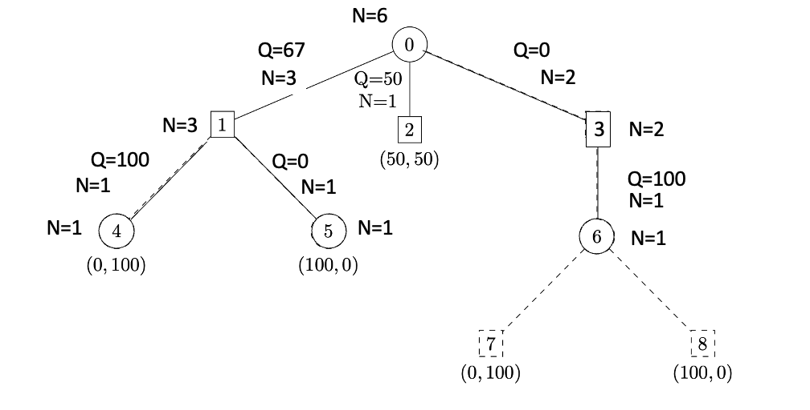

# Homework 4 – Artificial Intelligence

# Task 1

## 1.1
**Variables**: 
Each blank cell is a variable.
The set of variables is denoted as $V = \{v_1, v_2, ..., v_{w*k}\}$.

**Domains**: 
The domain of each variable is the set of the allowed letters.
For each variable $v_i$ the domain $D_i$ is $\{a,b, ..., z\}$.

**Constraints**: 
For each segment of contiguous blank cells, we add a constraint that the assigned letters form a word in the dictionary. 
More specifically, for each such segment, we create a constraint that involves the variables corresponding to the cells in that segment. 
This constraint ensures that the letters assigned to those variables form a valid word in the dictionary. 
We apply this constraint to each vertical and horizontal segment of blank cells in the grid.

Let the set $S$ contain all horizontal and vertical segments of blank cells.
For each horizontal or vertical segments of blank cells, let $S_i$ be a set which contains all cells of this segment.
Let $word(S_i)$ denote the concatenation of all letters assigned to the cells of this segment.
We then have the following n-ary constraints:

$\forall S_i: word(S_i) \in D$

## 1.2
**Search Tree**:
The proposed algorithm in the lecture to solve CSPs is DFS.
The depth $d$ of the search three is equal to the number of variables in our CSP
Since each blank cell is a variable, we have about $w*h$ variables.
The branching factor $b$ is 26 because each variable can be assigned with one of the letters from the alphabet.
The upper bound for the size of the search tree is $b^d = 26^{w*h}$.
The lower bound for the size of the search tree is $d = w*h$.
This case occurs if the first reached leave of the tree yields a goal state.

**State Space**
The state space contains all possible states.
We have $w*h$ variables.
Each of them can be assigned with $26$ letters.
Thus, in total we have  $26^{w*h}$ different states, which is the size of the state space.

## 1.3
**Variables**: 
All vertical or horizontal segments of blank cells (i.e. until a shaded cell is reached).
The set of variables is denoted as $V = \{v1, v2, ..., vk\}$.
We have at least $w*h$ variables.
This case occurs, if there are no shaded cells.

**Domains**: 
The domain of each variable is a subset of the provided dictionary of words.
This subset only contains the words which have the same length as the corresponding segment.
For each variable $v_i$, let $D_i$ be the subset of $D$ consisting of words of length $|v_i|$.

**Constraints**: 
Whenever there are intersecting vertical and horizontal contiguous segments of blank cells, we create a constraint between them that ensures the assigned words have the same letter at their intersection point, which is an unblocked cell. 
More specifically, we create a constraint that involves the variables corresponding to the cells in the two segments that intersect at that blank cell. 
This constraint enforces that the letters assigned to those variables are the same.

For each pair of intersecting segments $v_i$ and $v_j$, let $I$ be the set of cells that are common to both segments, i.e. the set of blank cells at the intersection of the segments.
Then, the constraint between vi and vj is defined as follows:
For each cell $c$ in $I$, let $x_{i,c}$ be the letter assigned to cell $c$ in segment $v_i$, and let $x_{j,c}$ be the letter assigned to cell $c$ in segment $v_j$. Then, the constraint between $v_i$ and $v_j$ is:

$\forall c \in I: x_{i,c} = x_{j,c}$

**Search Tree**:
The depth $d$ of the search three is equal to the number of variables in our CSP
Since each vertical or horizontal segment is a variable, we have at least $w*h$ variables.
The branching factor $b$ is $n$ because each variable can be assigned with one of the words from the dictionary.
The upper bound for the size of the search tree is $b^d = n^(w*h)$.
The lower bound for the size of the search tree is $d = w*h$.
This case occurs if the first reached leave of the tree yields a goal state.

**State Space**
Since we have at least $w*h$ variables and we can assign $n$ values to each variable, the state space is $n^{w*h}$
This is an lower bound estimation.

In general I assume $n>>26$. Thus, the estimates for the second definition are bigger than before. 
\newpage

# Task 2

## 2.1

After four iterations, the tree has the following structure:

I expanded the nodes in the following order: 3, 4, 5, 6
These are the final values of all actions of the tree:

Outgoing actions of node 0:

- $Q(0, left) = 67$
- $N(0, left) = 3$
- $Q(0, middle) = 50$
- $N(0, middle) = 1$
- $Q(0, right) = 0$
- $N(0, right) = 2$

Outgoing actions of node 1:

- $Q(1, left) = 100$
- $N(1, left) = 1$
- $Q(1, right) = 0$
- $N(1, right) = 1$

Outgoing actions of node 3:

- $Q(3, middle) = 100$
- $N(3, middle) = 1$

## 2.2
Player 1 would choose the action leading to node 1 (the leftmost action), because this action has the highest value $Q$.

## 2.3
A rational player would choose the actin leading to node 3 (the rightmost action), because in his next turn he can do a winning move for sure.
He would not choose the action leading to node 1, because player 2 would could win the game within one move.

## 2.4
This is not guaranteed in general, since MCTS relies on random playouts.
This means that even if the winning move is found, MCTS might compute higher averages in an other branch of the tree.
This is, because the averages result is based on the values of random plays, which do not reflect rational players.

In this small example, however, the value of $Q(0, left)$ might be reduced because the UTC formula prefers Node $4$ over Node $5$. This also results in a reduced $Q(0, left)$. On the other hand, with an increasing $N(0)$ the chances for Node $3$ to be selected, and afterwards the winning move towards Node $8$ increases.
At some point, the algorithm might yield the optimal solution. However, in further iterations this optimal solution might be discarded.

## 2.5
If we disable exploration (i.e. $c=0$), we would always select states with the highest current average value.
This effectively means, that we would ignore the number of visits. 
We would not explore new nodes which have not been tried yet.
Thus, our result will be suboptimal.

## 2.6
If we want to detect the winning move, the algorithm must operate in the right subtree. Thus, the UTC formula must deliver the highest value for the action leading to  node $3$.
In order for the UTC formula to select the right subtree (i.e. into the direction of the winning move), we rely on a big $N(0)$ because $Q(0, right)=0$.
In order to compensate the small Q(0, right), I expect that we require $\sqrt{\frac{ln(N(0))}{N(0,right)}} \approx 2.5$. 
In this case, the UTC formula would yield a value of approximately $50$ for the right subtree.

We know, that $N(0,right) = 2$. Thus $N(0)\approx 268337$ to solve the equation.
Please note that this is still a lower bound.
Thus, I expect at least $268337$ iterations until the right subtree is chosen.
At that time the UTC formula *might* select the right subtree. The algorithm still must compute the several iterations in order to ensure that the value $Q(0, right)>Q(0, left)$ and $Q(0, right)>Q(0, middle)$.
