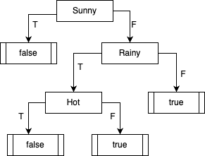

# Homework 6 – Artificial Intelligence

# Task 1: Overfitting/Underfitting

a) Underfitting occurs when a model is too simple to capture the underlying patterns and relationships in the data, leading to poor performance on both training and testing data. 
Overfitting occurs when a model is too complex and captures noise and random variations in the training data, leading to excellent performance on the training data but poor performance on the testing data. 
We can see if a model is underfitting or overfitting by comparing its performance on the training and testing data. 
If both error rates are high, the model is underfitting, while if the training error rate is low but the testing error rate is high, the model is overfitting.

b) A model might underfit if it is too simple and lacks the capacity to capture the complexity of the data. 
A model might overfit if it is too complex and captures noise and random variations in the training data.

c) Ignoring certain attributes is one way to avoid overfitting in decision trees,  especially if you observe attributes that are not relevant to the target variable.
This approach involves removing the least relevant attributes from the data before training the decision tree.

# Task 2: Decision Tree Learining

| Day | Decision Tree | PlayTennins |
|-----|---------------|-------------|
| 1   | False         | False       |
| 2   | False         | True        |
| 3   | False         | False       |
| 4   | False         | True        |
| 5   | False         | False       |
| 6   | True          | True        |

a) 
There are none.

b)
Day 2 and 4 because the result of the decision tree is `False` but the actual value is `True`

c) 
Both false negatives end up in `False` because `Rainy -> True` yields `False`.
This can be improved by replacing this leaf with the test `Hot`.
As a result, both day 2 and 4 would be classified correctly.
However, day 3 would be a new false negative.
See the updated decision tree attached.

d)
No because the labels for days 3 and 4 are exactly the same while both days are classified differently.
Thus, there cant be a decision tree which classifies both of them correctly.
